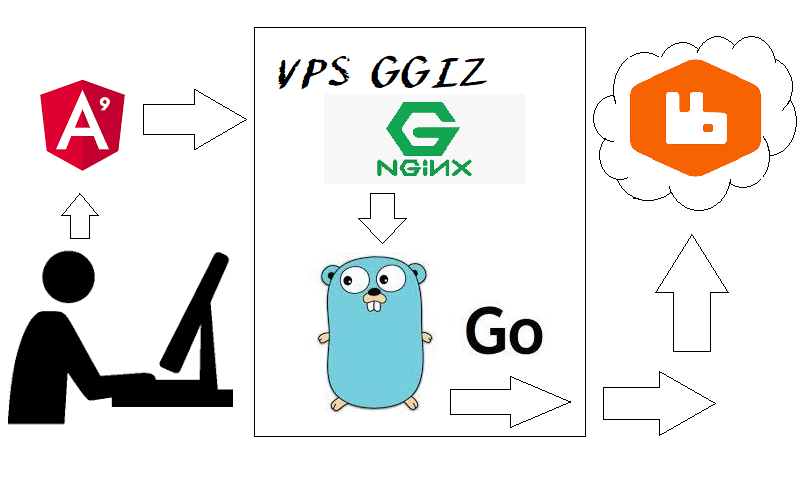

# ggiz.statistic.user

## Dependências 
Pessoal, deveria tratar melhor o mecanismo de dependência do projeto. Mas esta versão precisa ser feito de forma manual a inclusão dos pacotes. Esse projeto utiliza o pacote ***github.com/streadway/amqp*** como dependência para interação com o Ambiente RabbitMQ.

## Apresentação
Microsistema que interage com o Webclient GGIZ, recebendo informações de acesso de usuário. Após a devida formatação envia o dado pra uma fila no ambiente RabbitMQ.

## Fluxo Simplificado do Sistema

## Sobre o Código Fonte
O Código Fonte serve apenas para consulta técnica. Podendo servir de fonte de informação para quem quiser entender como funciona a interação de um sistema escito em ***Golang*** com ***RabbitMQ.***

⚠ ***ATENÇÃO*** ⚠
O Código Fonte e a Documentação estão em constante evolução.

👍 Obrigado por sua visita!
